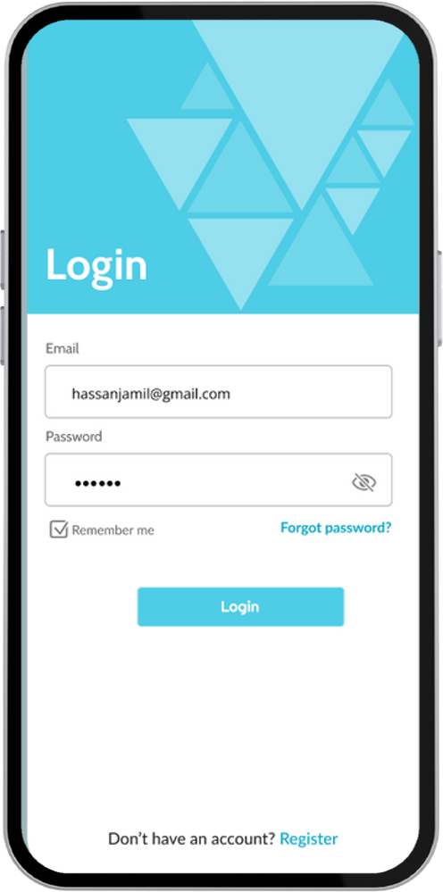
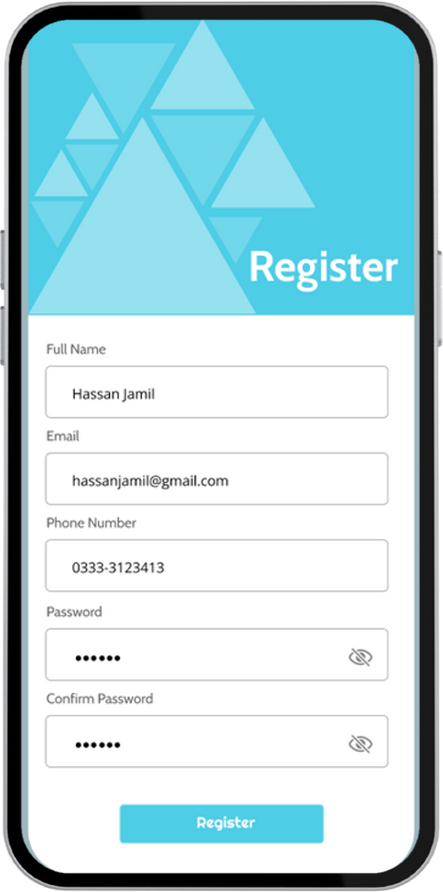

# Alliance-Tutoring-App

Hey, welcome to my FYP!

Alliance is an Android application, designed to serve as a platform for the tutors of Karachi to provide their services to students. It is developed using Flutter, Firebase, Stripe, HMS GetStream API, and 100ms API as its technological foundation. This application revolutionizes the tutoring landscape by providing a comprehensive platform for both tutors and students. One of its key achievements is addressing the challenges faced by private/home tutors, who heavily rely on word-of-mouth advertising for recognition. 
Alliance incorporates essential features such as in-app video calling, contracts, real-time messaging, and opportunities for volunteering work. By seamlessly integrating these functionalities, it offers a convenient and secure space for tutoring interactions.

|      **Splash Screen**      |      **Login Screen**      |      **Registration Screen**      |      **Home Screen**      |      **Search Screen**      |
|:--------------------------:|:--------------------------:|:--------------------------:|:--------------------------:|:--------------------------:|
|  |  |  |  |  |
|      **Tutor Profile Screen**      |      **Messaging Screen**      |      **Conversation Screen**      |      **Create Contract Screen**      |      **Video Conferencing Screen**     |
|  |  |  |  |  |

In order to run the application, you'll likely need all the keys used by the API's, which is why there is a public-release apk available instead. The source code can still be viewed.
